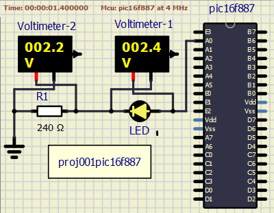

<!-- README.md file for proj001pic16f887 -->

## PROJECT: proj001pic16f887
---

### Aim:
---
To make an LED blink at regular interval.

### Apparatus/Software applications: 
---
- MPLAB X IDE v5.35
- SimulIDE_0.4.13-SR5

**Main Pogram**: [ledblink.c](./proj001pic16f887.x/ledblink.c)

### Circuit Diagram: 
---

### Description: 
---
* `__delay_ms(x)` is a macro to produce time delay in terms of milli-seconds.And it's definition is as follows:  
`#define __delay_ms(x) _delay((unsigned long)((x)*(_XTAL_FREQ/4000.0)))`  
where `_delay((unsigned long)((x)*(_XTAL_FREQ/4000.0)))` is `_delay(x)`.  
x in `_delay(x)` is the count of instruction cycles.  
`_XTAL_FREQ` is the operating frequency of the system (PIC16F887 in our case).
* At 4MHz, `__delay_ms(100)` is equal to `_delay(100000)`. That is, 100000 instruction cycles. Which makes 1 milli-second equal to 1 instruction cycle. Which finally means that `NOP` _--assembly instruction for no operation (which is a single cycle instruction.)--_ is performed 100000 times to achieve the 100 milli-second delay.  
* At 8MHz, `__delay_ms(100)` is equal to `_delay(200000)`. That is, 200000 instruction cycles to execute `NOP` instruction. At this frequency of the system, 2 instruction cycles perform `NOP` to achieve 1ms delay.  
* Just notice, how many instruction cycles are need to be `NOP` filled to achieve desired real time delay.
