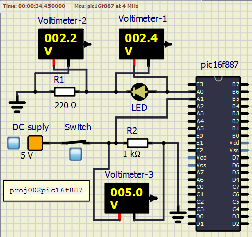

<!-- README.md file for proj002pic16f887 -->

## PROJECT: proj002pic16f887
---

## Aim:
---
 To make an LED glow as long as the switch is closed.

### Apparatus/Software applications: 
---
- MPLAB X IDE v5.35
- SimulIDE_0.4.13-SR5

**Main Pogram**: [ledblinkswitch.c](proj002pic16f887.X/ledblinkswitch.c)

<object data="proj002pic16f887.X/ledblinkswitch.c" type="text/c" width="600"></object>

|Components/Category|Components names in Circuit|
|---|---|
|Power supplies|DC supply|
|Integrated Circuits (IC)|PIC16F887|
|Resistors|R1(430 Ohm), R2(1 KOhm)|
|Voltmeters|Voltmeter-1, Voltmeter-2, Voltmeter-3|
|LEDs|LED|
|Switches|PushB|

### Circuit Diagram: 
---
**Note:** Unlit LED is blue in color and lit LED is reddish/pinkish in color.  
  
<i>**Figure:** proj002pic16f887a.png: Switch is opened and LED not glowing.</i>

  
<i>**Figure:** proj002pic16f887b.png: Switch is closed and LED glowing.</i>

## Description: 
---
- `RA0` pin is configured to be digital output pin. Power is supplied from this pin to LED.
- `RA1` pin is configured to be digital input pin. Power is supplied from the `DC supply` to the pin `RA1` upon closing switch `PushB`. And notice the <a href="#PD" title="Brief on Pull up/Pull down resistors is blow">pull down resistor</a>.
- `__delay_ms(x)` is a macro to produce time delay in terms of milli-seconds. And it's definition is as follows:  
`#define __delay_ms(x) _delay((unsigned long)((x)*(_XTAL_FREQ/4000.0)))`  
    > where 
    > - `_delay((unsigned long)((x)*(_XTAL_FREQ/4000.0)))` is `_delay(x)`.  
    > - x in `_delay(x)` is the count of instruction cycles.  
    > - `_XTAL_FREQ` is the operating frequency of the system (PIC16F887 in our case).
* At 4MHz, `__delay_ms(100)` is equal to `_delay(100000)`. That is, 100000 instruction cycles. Which makes 1 milli-second equal to 1 instruction cycle. Which finally means that `NOP` _--assembly instruction for no operation (which is a single cycle instruction.)--_ is performed 100000 times to achieve the 100 milli-second delay.  
* At 8MHz, `__delay_ms(100)` is equal to `_delay(200000)`. That is, 200000 instruction cycles to execute `NOP` instruction. At this frequency of the system, 2 instruction cycles perform `NOP` to achieve 1ms delay.  
* Just notice, how many instruction cycles are need to be `NOP` filled to achieve desired real time delay.

---
   <!--br tag is just line-break tag in html-->

## Pull up resistor / Pull down resistor
---
**Source:** <https://eepower.com/resistor-guide/resistor-applications/pull-up-resistor-pull-down-resistor/>  

**What are pull-up resistors?**  
Pull-up resistors are resistors used in logic circuits to ensure a well-defined logical level at a pin under all conditions. As a reminder, digital logic circuits have _`three logic states`_: `high`, `low` and `floating` (or `high impedance`). The high-impedance state occurs when the pin is not pulled to a high or low logic level, but is left “floating instead. A good illustration of this is an unconnected input pin of a microcontroller. It is neither in a high or low logic state, and a microcontroller might unpredictably interpret the input value as either a logical high or logical low. Pull-up resistors are used to solve the dilemma for the microcontroller by pulling the value to a logical high state, as seen in the figure. If there weren’t for the pull-up resistor, the MCU’s input would be floating when the switch is open and brought down only when the switch is closed.  

  
<i>**Figure:** pull_up_resistor.jpg: Pull Up Resistor</i>

Pull-up resistors are not a special kind of resistors; they are simple fixed-value resistors connected between the voltage supply (usually +5V) and the appropriate pin, which results in defining the input or output voltage in the absence of a driving signal. A typical pull-up resistor value is 4.7kΩ, but can vary depending on the application.

**Pull-up resistor definition**
>Pull-up resistors are resistors which are used to ensure that a wire is pulled to a high logical level in the absence of an input signal.

**What are pull-down resistors?**  
Pull-down resistors work in the same manner as pull-up resistors, except that they pull the pin to a logical low value. They are connected between ground and the appropriate pin on a device. An example of a pull-down resistor in a digital circuit can be seen in the figure. A pushbutton switch is connected between the supply voltage and a microcontroller pin. In such a circuit, when the switch is closed, the micro-controller input is at a logical high value, but when the switch is open, the pull-down resistor pulls the input voltage down to ground (logical zero value), preventing an undefined state at the input. The pull-down resistor must have a larger resistance than the impedance of the logic circuit, or else it might be able to pull the voltage down by too much and the input voltage at the pin would remain at a constant logical low value – regardless of the switch position.

  
<i>**Figure:** pull_down_resistor.jpg: Pull Down Resistor</i>

**Pull-up resistor value**  
The appropriate value for the pull-up resistor is limited by two factors. The first factor is power dissipation. If the resistance value is too low, a high current will flow through the pull-up resistor, heating the device and using up an unnecessary amount of power when the switch is closed. This condition is called a strong pull-up and is avoided when low power consumption is a requirement. The second factor is the pin voltage when the switch is open. If the pull-up resistance value is too high, combined with a large leakage current of the input pin, the input voltage can become insufficient when the switch is open. This condition is called having a weak pull-up. The actual value of the pull-up’s resistance depends on the impedance of the input pin, which is closely related to the pin’s leakage current.

A rule of thumb is to use a resistor that is at least 10 times smaller than the value of the input pin impedance. In bipolar logic families which operate at 5V, the typical pull-up resistor value is 1-5 kΩ. For switch and resistive sensor applications, the typical pull-up resistor value is 1-10 kΩ. If in doubt, a good starting point when using a switch is 4.7 kΩ. Some digital circuits, such as CMOS families, have a small input leakage current, allowing much higher resistance values, from around 10kΩ up to 1MΩ. The disadvantage when using a larger resistance value is that the input pin responses to voltage changes slower. This is the result of the coupling between the pull-up resistor and the line capacitance of the wire which forms an RC circuit. The larger the product of R and C, the more time is needed for the capacitance to charge and discharge, and consequently the slower the circuit. In high-speed circuits, a large pull-up resistor can sometimes limit the speed at which the pin can reliably change state.

**Typical applications for pull-up and pull-down resistors**  
Pull-up and pull-down resistors are often used when interfacing a switch or some other input with a microcontroller or other digital gates. Most microcontrollers have in-built programmable pull up/down resistors so fewer external components are needed. It is possible to interface a switch with such microcontrollers directly. Pull-up resistors are in general used more often than pull-down resistors, although some microcontroller families have both pull-up and pull-downs available.

They are often used in analog to digital converters to provide a controlled current flow into a resistive sensor.

Another application is the I2C protocol bus, where pull-up resistors are used to enable a single pin to act as an input or an output. When not connected to a bus, the pin floats in a high-impedance state.

Pull-down resistors are also used on outputs to provide a known output impedance.

---