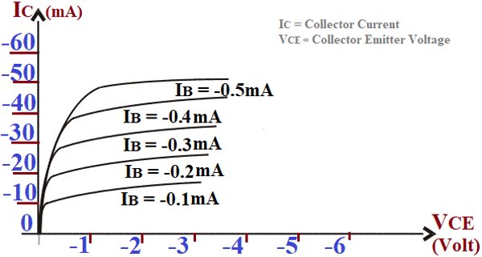
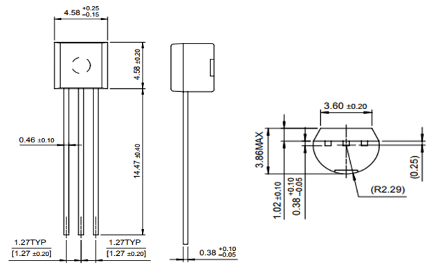

<!-- README.md file for proj004pic16f887 -->

## PROJECT: proj004pic16f887
---

## Aim:
---
Interface four 7-segment LEDs with PIC16F887 and display a four digit number (Display 4-digit integer number using the multiplexed 7-segment display interface).

### Apparatus/Software applications: 
---
- MPLAB X IDE v5.35
- SimulIDE_0.4.13-SR5

**Main Program**: [sevensegment.c](proj004pic16f887.X/sevensegment.c)

<object data="proj004pic16f887.X/sevensegment.c" type="text/c" width="600"></object>

|Components/Category|Components names in Circuit|
|---|---|
|Integrated Circuits (IC)|PIC16F887|
|Resistors/Resisor Dips|ResistorDip-1(100 Ohm), ResistorDip-2(1 KOhm), ResistorDip-3(100 Ohm)|
|Voltmeters|Voltmeter-1, Voltmeter-2, Voltmeter-3, Voltmeter-4, Voltmeter-5, Voltmeter-6, Voltmeter-7|
|7-Segment LED displays|7-Segment1, 7-Segment2, 7-Segment3, 7-Segment4|
|Transistors|BJT-1, BJT-2, BJT-3, BJT-4|

### Circuit Diagram: 
---
**Note:** Unlit LED/LED segment is blue in color and lit LED is reddish/pinkish in color.  

  
<i>**Figure:** proj004pic16f887.png: Interface of PIC16F887 with four 7-segment LED displays.</i>

[A video clip of circuit simulation.](proj004pic16f887.mp4
)

<video src="proj004pic16f887.mp4" type="video/mp4" controls muted width="500" height="400">Video tag not supported</video>  <!--atributes: autoplay loop -->

## Description: 
---
- `PORTB` is used to feed the LEDs in each segment. Therefore, `PORTB` is made an output port using `TRISB` register. Just to make sure we can assign `ANSELH` register with value `0x00` manually in the program though it is set so on MCU power-up.
- `PORTC` is also made as a digital ouput port using `TRISC` and it acts as segment selector.
- ***What happens:***
    > - Each 7-segment LED display contains 8 LEDs. And a sink connection. And there are four segments, resulting in 32 LEDs to be fed from a single 8-bit port of the microcontroller.
    > - If all the segments are fed at the same instant, the current will get divided among the LEDs resulting in low intensity output of LEDs and high power consumption. Therefore, the control (4 lines --upper nibble of PORTC--) lines are used to choose only one segment at a time.
    > - On doing so, all 32 LEDs are fed using only 8 lines with full current to each segment's LEDs.
    > - The control lines' use is as follows: Consider `7-segment2` and its control line `RC5` which is responsible for `BJT-2` ([Read abouit BJTs here](#BJT "BJT")) to act as switch. When `RC5` is made high (i.e., `PORTC=0x20`) making other control lines low, the current of that line becomes base current of `BJT-2` which activates it making the circuit a closed circuit. At the same time `RC7`, `RC6` and `RC4` are at `0V` resulting in `BJT-4`, `BJT-3` and `BJT-1` to be in `OFF` state making their respective circuit paths open circuits. Therefore, only one segment is fed at a time with full `power`.
    > - And we cannot simply notice the shift of power from segment to segment with our bare eyes and they look as if all the segments are lit at the same instant. Because each segment are lit for only `2 milli-seconds` but at `4MHz` frequency.
- The HEX codes to generate each digit on segment are found as follows.  
  
<i>**Figure:** sevenseg.png: 7-segment LED displays.</i>

|Digit|RB7/a|RB6/b|RB5/c|RB4/d|RB3/e|RB2/f|RB1/g|RB0/h|PORTB|
|---|---|---|---|---|---|---|---|---|---|
|0|1|1|1|1|1|1|0|0|0xfc|
|1|0|1|1|0|0|0|0|0|0x60|
|2|1|1|0|1|1|0|1|0|0xda|
|3|1|1|1|1|0|0|1|0|0xf2|
|4|0|1|1|0|0|1|1|0|0x66|
|5|1|0|1|1|0|1|1|0|0xb6|
|6|1|0|1|1|1|1|1|0|0xbe|
|7|1|1|1|0|0|0|0|0|0xe0|
|8|1|1|1|1|1|1|1|0|0xfe|
|9|1|1|1|1|0|1|1|0|0xf6|

 

- `__delay_ms(x)` is a macro to produce time delay in terms of milli-seconds. And it's definition is as follows:  
`#define __delay_ms(x) _delay((unsigned long)((x)*(_XTAL_FREQ/4000.0)))`  
    > where 
    > - `_delay((unsigned long)((x)*(_XTAL_FREQ/4000.0)))` is `_delay(x)`.  
    > - `x` in `_delay(x)` is the count of instruction cycles.  
    > - `_XTAL_FREQ` is the operating frequency of the system (PIC16F887 in our case).
* At 4MHz, `__delay_ms(100)` is equal to `_delay(100000)`. That is, 100000 instruction cycles. Which makes 1 milli-second equal to 1 instruction cycle. Which finally means that `NOP` _--assembly instruction for no operation (which is a single cycle instruction.)--_ is performed 100000 times to achieve the 100 milli-second delay.  
* At 8MHz, `__delay_ms(100)` is equal to `_delay(200000)`. That is, 200000 instruction cycles to execute `NOP` instruction. At this frequency of the system, 2 instruction cycles perform `NOP` to achieve 1ms delay.  
* Just notice, how many instruction cycles are need to be `NOP` filled to achieve desired real time delay.

---
 

## Bipolar Junction Transistor
---

**Source:** <https://components101.com/articles/understanding-bjt-transistor-and-how-to-use-it-in-your-circuit-designs#:~:text=BJT%20is%20the%20short%20form,it%20can%20be%20controlled%20electronically.)>

**Understanding BJT Transistors and How to Practically Use Them in Your Designs**  
  
<i>**Figure:** Bipolr Junction Transistor</i>  
Transistors are one of the very important components used in electronic circuit constructions. These humble components can almost be found everywhere; from simple relay driver circuits to complex motherboard circuits, transistors prove their presence. In fact, your microcontrollers and microprocessors are nothing but a collection of a large number of transistors synthesized to perform a collective operation. Do remember that many switching devices like BJT, MOSFET, IGBT, SCR, TRIAC, DIAC, etc. can be collectively called transistors. But, the most basic (oldest) of the transistor is the BJT Transistor. Hence in this article, we get into details of that.

BJT is the short form of Bipolar Junction Transistor, it is a solid-state *current-controlled device* which can be used to electronically switch a circuit, you can think of it as your normal Fan or Light switch, but instead of you turning it on manually it can be controlled electronically. Technically speaking, BJT is a three-terminal device with an Emitter, collector, and a base pin, the current flow through the emitter and collector are controlled by the amount of current applied to the base. Again you can think of emitter and collector as the two ends of your switch and instead of pressing the switch, we have the base pin which can receive the control signal. But how exactly does it work? And how to use a transistor to build interesting circuits? That's exactly what we are going to answer in this Tutorial.

**Symbol of BJT Transistors**  
Let's start with the symbol of transistors so that you can identify them in a circuit. The below diagram shows the symbols of the two types of transistors. The one on the left is the symbol of the PNP transistor and the one on the right is the symbol of the NPN transistor. As I said, you will be able to see the three terminals Emitter, Collector, and Base for both the type of Transistor.  
  
<i>**Figure:** BJT-Symbol.png: Circuit symbol of BJT.</i>  

The difference between the PNP and NPN transistors is that the arrow mark at the emitter end if you have noticed, the arrow in the PNP transistor is mentioned as moving from the emitter to the base whereas in the NPN transistor the arrow will be moving from the base to the emitter. The Direction of the arrow represents the direction of current flow in the transistor, in PNP the current will be flowing from emitter to base, similarly in the NPN transistor current will be flowing from the base to emitter.  
  
<i>*Figure:* NPNandPNP-Transistor-Working.gif: </i>

Another important difference is that an NPN transistor remains open until it receives a signal on the base pin while a PNP transistor remains closed until a control signal is provided to the base pin as shown in the above GIF file.

**Construction of Bipolar Junction Transistor**  
The BJT is formed by three layers of semiconductor materials, if it is a PNP transistor, it will have two P-type regions and one N-type region, likewise, if it is an NPN transistor, it will have two N-type regions and one P-type region. The two outer layers are where the collector and emitter terminals are fixed and the base terminal is fixed at the center layer.  
  
<i>**Figure:** NPN-VS-PNP-BJT.png</i>  

The construction can simply be explained with a two diode analogy for transistor as shown in the above image. Consider the two diodes connected with each other using the cathode, then the meeting point can be extended to form the base terminal and the two anodes end acts as the collector and emitter of a PNP transistor. Similarly, if you connect the anode ends of the Diode then the meeting point of the anodes can be extended to for the base terminal and the two cathode ends act as the collector and emitter of the NPN transistor.

**Working of Transistor (BJT)**  
Practically the working of a transistor is very simple, it can be used as a switch or as an amplifier. But for basic understanding lets start with how `transistor as a switch` works in a circuit.  
When a control voltage is provided to the base pin, the required `base current (IB)` flows into the base pin which is controlled by a base resistor. This current turns on the transistor (switch is closed) and allows the current to flow from collector to emitter. This current is called the `collector current (IC)` and the voltage across the collector and emitter is called `VBE`.

Now for the theory, consider an NPN transistor, the BE junction is forward biased and the CB junction is reverse biased. The width of the depletion region at the Junction CB is higher when compared with the depletion region of the Junction BE. When the BE junction is forward biased it decreases the barrier potential, hence the electrons start flowing from the emitter to the base. The base region is very thin and it is lightly doped when compared with other regions, hence it consists of a very small number of holes, the electrons that are flowing from the emitter will recombine with the holes present in the base region and start to flow out of the base region in the form of the base current. A large number of electrons that are left will move across the reverse bias collector junction in the form of the collector current.  
  
<i>**Figure:** Bipolar-Junction-Transistor-Working.png</i>  

Based on the Kirchoff’s Current Law, we can frame the current equation as  
`IE = IB + IC`  
Where,   
> IE, IB, and IC are the emitter, base, and collector current respectively. Here the base current will be very small when compared with emitter and collector current, therefore, `IE ≈ IC` (Or we can say `IE = IC`).

Similarly, when you consider the PNP Transistor, they operate in the same way as the NPN transistor, but in NPN transistors the majority charge carriers are holes (Positively charged particle) but in the NPN transistor the charge carriers are the electrons (negatively charged particle).

**Characteristics of BJT**  
BJT can be connected in three different configurations by keeping one terminal common and using the other two terminals for the input and output. These three types of configurations respond differently to the input signal applied to the circuit because of the static characteristics of the BJT. The three different configurations of BJT are listed below.
- Common Base (CB) configuration
- Common Emitter (CE) configuration
- Common Collector (CC) Configuration

Among these, the Common Base configurations will have voltage gain, but no current gain, whereas the Common Collector Configuration has current gain, but no voltage gain and the Common Emitter Configuration will have both current and voltage gain.

<u>**Common Base (CB) Configuration**</u>

The Common Base configuration is also called as the `grounded base configuration`, where the base of the BJT is connected as a common between both the input and output signal. The input to the BJT is applied across the Base and Emitter Terminals and the output from the BJT is obtained across the Base and Collector terminal. The input current (IE) flowing through the emitter will be quite higher when compared with both the Base current (IB) and the Collector Current (IC) as the emitter current is the sum of both the Base current and Collector current. Since the collector current output is less than the Emitter current input the `current gain of this configuration will be unity (1) or less`.  
  
<i>**Figure:** BJT-Common-Base-Configuration.png</i>  

**Input characteristics**  
The input Characteristic curve for the Common Base configurations is drawn between the emitter current IE and the voltage between the base and emitter VEB. During the Common base configuration, the Transistor gets forward biased hence it will show characteristics similar to that of the forward characteristics of a p-n diode where the IE increases for fixed VEB when VCB increases.  
  
<i>**Figure:** Common-Base-Input-Characteristic.png</i>

**Output Characteristics**  
The output characteristics of the Common Base configuration are given between the collector current IC and the voltage between the collector and base VCB, here the emitter Current IE is the measuring parameter. Based on the operation, there are `three different regions in the curve`, at first, the `active region`, here the BJT will be operating normally and the emitter junction is reverse biased. Next comes the `saturation region` where both the emitter and collector junctions are forward biased. Finally, the `cutoff region` where both emitter and the collector junctions are reverse biased.  
  
<i>**Figure:** Common-Base-Output-Characteristic.png</i>

<u>**Common Emitter (CE) Configuration**</u>

The Common Emitter Configuration is also called the `grounded emitter configuration` where the emitter acts as the common terminal between the input applied between the base and emitter and the output obtained between the collector and the emitter. This configuration produces the highest current and power gain when compared with the other two types of configurations, this is because of the fact that the input impedance is low as it is connected to a forward-biased PN junction whereas the output impedance is high as it is obtained for the reverse-biased PN junction.  
  
<i>**Figure:** BJT-Common-Emitter-Configuration.png: Transistor Common Emitter Configuration</i>

**Input Characteristics**  
The input characteristics of the Common Emitter configuration are drawn between the base current IB and the voltage between the base and emitter VBE. Here the Voltage between the Collector and the emitter is the most common parameter. If you could see there will not be much difference between the characteristic curve of the previous configuration except for the change in parameters.  
  
<i>**Figure:** Common-Emitter-Input-Characteristic.png</i>  

**Output Characteristics**  
The output characteristics are drawn between the Collector Current IC  and the voltage between the collector and the Emitter VCE. The CE configuration also has the three different regions, in the active region the collector junction is reverse biased and the emitter junction is forward biased, in the cut-off region, the emitter junction is slightly reverse biased and the collector current is not completely cut off, and finally, in the saturation region, both the collector and the emitter junctions are forward biased.  
  
<i>**Figure:** Common-Emitter-Output-Characteristic.png</i>

<u>**Common Collector (CC) Configuration**</u>

The Common Collector Configuration is also called the `grounded Collector configuration` where the collector terminal is kept as the common terminal between the input signal applied across the base and the emitter, and the output signal obtained across the collector and the emitter. This configuration is commonly called as the `Voltage follower` or `the emitter follower circuit`. This configuration will be useful for impedance matching applications as it has very high input impedance, in the region of hundreds of thousands of ohms while having relatively low output impedance.  
  
<i>**Figure:** BJT-Common-Collector-Configuration.png</i>

**Application of Bipolar Junction Transistors (BJT)**  
BJT can be used in various kinds of applications such as logic circuits, amplification circuits, oscillation circuits, multi-vibrator circuits, clipping circuits, circuits of the timer, time delay circuits, switching circuits, etc.

**Types of packages**  
  
<i>**Figure:** IC-Package.jpg</i>  
For the better usage in different kinds of applications, BJTs are available in various packages such as TO-3, TO-5, TO-8, TO-18, TO-36, TO-39, TO-46, TO-52, TO-66, TO-72, TO-92, TO-126, TO-202, TO-218, TO-220, TO-226, TO-254, TO-257, TO-258, TO-259, TO-264, and TO-267.

---
## BC547 Transistor
---
**NOTE:** Look-out for data sheet on the internet for full specifications.  
**Source:** https://components101.com/bc547-transistor-pinout-datasheet

  
<i>**Figure:** BC547-Transistor-Pinout.png</i>  
 
**Pin Configuration**
|Pin Number|Pin Name|Description|
|---|---|---|
|1|Collector|Current flows in through collector|
|2|Base|Controls the biasing of transistor|
|3|Emitter|Current Drains out through emitter|

**BC547 Transistor Features**
- Bi-Polar NPN Transistor
- DC Current Gain (hFE) is 800 maximum
- Continuous Collector current (IC) is 100mA
- Emitter Base Voltage (VBE) is 6V
- Base Current(IB) is 5mA maximum
- Available in To-92 Package

**BC547 Equivalent Transistors**  
BC549, BC636, BC639, 2N2222 TO-92, 2N2222 TO-18, 2N2369, 2N3055, 2N3904, 2N3906, 2SC5200
 
**Brief Description on BC547**  
BC547 is an NPN transistor hence the collector and emitter will be left open (Reverse biased) when the base pin is held at ground and will be closed (Forward biased) when a signal is provided to base pin. BC547 has a gain value of 110 to 800, this value determines the amplification capacity of the transistor. The maximum amount of current that could flow through the Collector pin is 100mA, hence we cannot connect loads that consume more than 100mA using this transistor. To bias a transistor we have to supply current to base pin, this current (IB) should be limited to 5mA.

When this transistor is fully biased then it can allow a maximum of 100mA to flow across the collector and emitter. This stage is called `Saturation Region` and the typical voltage allowed across the Collector-Emitter (V­CE) or Base-Emitter (VBE) could be 200 and 900 mV respectively. When base current is removed the transistor becomes fully off, this stage is called as the `Cut-off Region` and the Base Emitter voltage could be around 660 mV.

**BC547 as Switch**  
When a transistor is used as a switch it is operated in the Saturation and Cut-Off Region as explained above. As discussed a transistor will act as an Open switch during Forward Bias and as a Closed switch during Reverse Bias, this biasing can be achieved by supplying the required amount of current to the base pin. As mentioned the biasing current should maximum of 5mA. Anything more than 5mA will kill the Transistor; hence a resistor is always added in series with base pin. The value of this resistor (RB) can be calculated using below formula.  
`RB  = VBE / IB`  
Where,  
> the value of VBE should be 5V for BC547 and the Base current (IB) depends on the Collector current (IC). The value of IB should not exceed 5mA.

**BC547 as Amplifier**  
A Transistors acts as an Amplifier when operating in Active Region. It can amplify power, voltage and current at different configurations.

Some of the configurations used in amplifier circuits are
- Common emitter amplifier
- Common collector amplifier
- Common base amplifier

Of the above types common emitter type is the popular and mostly used configuration. When uses as an Amplifier the DC current gain of the Transistor can be calculated by using the below formula.

`DC Current Gain = Collector Current (IC) / Base Current (IB)`

**Applications**  
- Driver Modules like Relay Driver, LED driver etc..
- Amplifier modules like Audio amplifiers, signal Amplifier etc..
- Darlington pair

**2D model of the component**  
If you are designing a PCD or Perf board with this component then the following picture from the Datasheet will be useful to know its package type and dimensions.  
  
<i>**Figure:** BC547-2D-Model.png</i>  

---