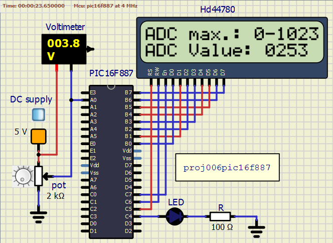

<!-- README.md file for proj006pic16f887 -->

## PROJECT: proj006pic16f887
---

## Aim:
---
To demonstrate Analog to Digital Conversion using internal ADC module of PIC16F887.

### Apparatus/Software applications: 
---
- MPLAB X IDE v5.35
- SimulIDE_0.4.13-SR5

**Main Program**: [adcmodule.c](proj006pic16f887.X/adcmodule.c)

<object data="proj006pic16f887.X/adcmodule.c" type="text/c" width="600"></object>

|Components/Category|Components names in Circuit|
|---|---|
|Integrated Circuits (IC)|PIC16F887|
|LCD|HD44780|
|Power Supply|DC supply|
|Resistors|R(100 Ohm), Potentiometer(5 KOhm)|
|Voltmeters|Voltmeter|
|LEDs|LED|

 

### Circuit Diagram: 
---

**Note:** Lit LEDs turn yellow in color.

  
<i>**Figure:** proj006pic16f887.png: Demonstration of internal ADC of PIC16F887 and interfacing LCD(16x2 Character matrix 5x8 dot matrix) to display ADC value.</i>

[A video clip of circuit simulation.](proj006pic16f887.mp4
)

<video src="proj006pic16f887.mp4" type="video/mp4" controls muted width="500" height="400">Video tag not supported</video>  <!--atributes: autoplay loop -->

## Description: 
---
- **A/D Conversion procedure**  
This is an example procedure for using the ADC to
perform an Analog-to-Digital conversion:
> 1 Configure Port:
>> - Disable pin output driver (See TRIS register)
>> - Configure pin as analog

> 2 Configure the ADC module:
>> - Select ADC conversion clock
>> - Configure voltage reference
>> - Select ADC input channel
>> - Select result format
>> - Turn on ADC module

> 3 Configure ADC interrupt (optional):
>> - Clear ADC interrupt flag
>> - Enable ADC interrupt
>> - Enable peripheral interrupt
>> - Enable global interrupt

> 4 Wait the required acquisition time.

> 5 Start conversion by setting the GO/DONE bit.

> 6 Wait for ADC conversion to complete by one of the following:
>> - Polling the GO/DONE bit
>> - Waiting for the ADC interrupt (interrupts enabled)

> 7 Read ADC Result

> 8 Clear the ADC interrupt flag (required if interrupt is enabled).

- `RA0` is made as analog input using `TRISA0` of `TRISA` and `ANS0` of `ANSEL` respectively; which will be chosen as `AN0`, an ADC input channel.
- `PORTB` is used to send 8-bit data to display characters on the LCD screen or 8-bit command value to control the possible aspects of the LCD (like cursor position, clearing screen, etc.). `PORTB` direction of operation is controlled using `TRISB`. Just to make sure the port to be a digital port, we can assign `ANSELH` register with value `0x00` manually in the program though it is set so on MCU power-up.
- `RC7`, `RC6` and `RC5` of `PORTC` are used as control lines of LCD (viz, `EN`, `RW` and `RS` respectively).
- `RC4` is used to drive an LED, which lits as long as the A/D conversion is in progress. Just as an indicator.
- **HD44780**
> - **Pinout diagram**  
  
*NOTE:* In our circuit diagram created from simulIDE, the potentiometer connections and few other pins are hidden. But are necessary during practical circuit.

> - **Pin Description**  
> *Source:* <https://en.wikipedia.org/wiki/Hitachi_HD44780_LCD_controller>  
<table>
    <tr><th align="center">Pin No.</th><th align="center">Pin Description</th></tr>
    <tr><td>1</td><td>Ground</td></tr>
    <tr><td>2</td><td>VCC +3.3 to +5V (typical)</td></tr>
    <tr><td>3</td><td>Contrast adjustment (VO) This is an analog input, typically connected to a potentiometer. The user must be able to control this voltage independent of all other adjustments, in order to optimise visibility of the display that varies i.a. with temperature, and, in some cases height above the sea level. With a wrong adjustment the display will seem to malfunction.</td></tr>
    <tr><td>4</td><td>Register Select (RS). RS=0: Command, RS=1: Data</td></tr>
    <tr><td>5</td><td>Read/Write (R/W). R/W=0: Write, R/W=1: Read (In most applications reading from the HD44780 makes no sense. In that case this pin can be permanently connected to ground and no io pins need to be allocated to steer it.)</td></tr>
    <tr><td>6</td><td>Clock (Enable). Falling edge triggered</td></tr>
    <tr><td>7</td><td>Bit 0 (Not used in 4-bit operation)</td></tr>
    <tr><td>8</td><td>Bit 1 (Not used in 4-bit operation)</td></tr>
    <tr><td>9</td><td>Bit 2 (Not used in 4-bit operation)</td></tr>
    <tr><td>10</td><td>Bit 3 (Not used in 4-bit operation)</td></tr>
    <tr><td>11</td><td>Bit 4</td></tr>
    <tr><td>12</td><td>Bit 5</td></tr>
    <tr><td>13</td><td>Bit 6</td></tr>
    <tr><td>14</td><td>Bit 7</td></tr>
    <tr><td>15</td><td>Backlight Anode (+) (If applicable)</td></tr>
    <tr><td>16</td><td>Backlight Cathode (-) (If applicable)</td></tr>
</table>

> - **Instruction Set**  
> *Source:* <https://en.wikipedia.org/wiki/Hitachi_HD44780_LCD_controller>  

<table>
    <tr>
        <th rowspan="2" align="center">Instruction</th>
        <th colspan="10" align="center">Code</th>
        <th rowspan="2" align="center">Description</th>
        <th rowspan="2" align="center">Execution time (max)(when fcp = 270 kHz)</th>
    </tr>
    <tr>
        <td>RS</td><td>R/W</td>
        <td>B7</td><td>B6</td><td>B5</td><td>B4</td><td>B3</td><td>B2</td><td>B1</td><td>B0</td>
    </tr>
    <tr>
        <td>Clear Display</td><td>0</td><td>0</td>
        <td>0</td><td>0</td><td>0</td><td>0</td><td>0</td><td>0</td><td>0</td><td>1</td>
        <td>Clears display and returns cursor to the home position (address 0).</td>
        <td>1.52 ms</td>
    </tr>
	<tr>
        <td>Cursor home</td><td>0</td><td>0</td>
        <td>0</td><td>0</td><td>0</td><td>0</td><td>0</td><td>0</td><td>1</td><td>*</td>
        <td>Returns cursor to home position. Also returns display being shifted to the original position. DDRAM content remains unchanged.</td>
        <td>1.52 ms</td>
    </tr>
    <tr>
        <td>Entry mode set</td><td>0</td><td>0</td>
        <td>0</td><td>0</td><td>0</td><td>0</td><td>0</td><td>1</td><td>I/D</td><td>S</td>
        <td>Sets cursor move direction (I/D); specifies to shift the display (S). These operations are performed during data read/write.</td>
        <td>37 μs</td>
    </tr>
    <tr>
        <td>Display on/off control</td><td>0</td><td>0</td>
        <td>0</td><td>0</td><td>0</td><td>0</td><td>1</td><td>D</td><td>C</td><td>B</td>
        <td>Sets on/off of all display (D), cursor on/off (C), and blink of cursor position character (B).</td>
        <td>37 μs</td>
    </tr>
	<tr>
        <td>Cursor/display shift</td><td>0</td><td>0</td>
        <td>0</td><td>0</td><td>0</td><td>1</td><td>S/C</td><td>R/L</td><td>*</td><td>*</td>
        <td>Sets cursor-move or display-shift (S/C), shift direction (R/L). DDRAM content remains unchanged.</td>
        <td>37 μs</td>
    </tr>
	<tr>
        <td>Function set</td><td>0</td><td>0</td>
        <td>0</td><td>0</td><td>1</td><td>DL</td><td>N</td><td>F</td><td>*</td><td>*</td>
        <td>Sets interface data length (DL), number of display line (N), and character font (F).</td>
        <td>37 μs</td>
    </tr>
	<tr>
        <td>Set CGRAM address</td><td>0</td><td>0</td>
        <td>0</td><td>1</td>
        <td colspan="6" align="center">CGRAM address</td>
        <td>Sets the CGRAM address. CGRAM data are sent and received after this setting.</td>
        <td>37 μs</td>
    </tr>
	<tr>
        <td>Set DDRAM address</td><td>0</td>
        <td>0</td><td>1</td><td colspan="7" align="center">DDRAM address</td>
        <td>Sets the DDRAM address. DDRAM data are sent and received after this setting.</td>
        <td>37 μs</td>
    </tr>
	<tr>
        <td>Read busy flag & address counter</td><td>0</td><td>1</td>
        <td>BF</td><td align="center" colspan="7">CGRAM/DDRAM address</td>
        <td>Reads busy flag (BF) indicating internal operation being performed and reads CGRAM or DDRAM address counter contents (depending on previous instruction).</td>
        <td>0 μs</td>
    </tr>
	<tr>
        <td>Write CGRAM or DDRAM</td><td>1</td><td>0</td>
        <td align="center" colspan="8">Write Data</td>
        <td>Write data to CGRAM or DDRAM.</td>
        <td>37 μs</td>
    </tr>
    <tr>
        <td>Read from CG/DDRAM</td><td>1</td><td>1</td>
        <td align="center" colspan="8">Read Data</td>
        <td>Read data from CGRAM or DDRAM.</td>
        <td>37 μs</td>
    </tr>
    <tr>
        <td colspan="13" align="justify">
        Instruction bit names —

I/D - 0 = decrement cursor position, 1 = increment cursor position; S - 0 = no display shift, 1 = display shift; D - 0 = display off, 1 = display on; C - 0 = cursor off, 1 = cursor on; B - 0 = cursor blink off, 1 = cursor blink on ; S/C - 0 = move cursor, 1 = shift display; R/L - 0 = shift left, 1 = shift right; DL - 0 = 4-bit interface, 1 = 8-bit interface; N - 0 = 1/8 or 1/11 duty (1 line), 1 = 1/16 duty (2 lines); F - 0 = 5×8 dots, 1 = 5×10 dots; BF - 0 = can accept instruction, 1 = internal operation in progress.
        </td>
    </tr>
</table>

> - Few specific byte-codes to highlight:
>> - `0x04` - move cursor right, don’t shift display.
>> - `0x05` - move cursor right, do shift display (left).
>> - `0x06` - move cursor right, don’t shift display (this is the most common).
>> - `0x07` - move cursor right, do shift display (left).
>> - `0x08 ... 0x0B` - turn display off.
>> - `0x0c` - display on, cursor off.
>> - `0x0e` - display on, cursor on, steady cursor.
>> - `0x0f` - display on, cursor on, blinking cursor.
>> - `0x10` - Shift cursor left.
>> - `0x14` - Shift cursor right.
>> - `0x18` - Shift display left.
>> - `0x1c` - Shift display right.
>> - `0x80 + position` - Cursor position
> - HD44780 is designed to control a 40 character 4-line display. If you have a 16×2 then you will only see the first 16 characters of the top two lines. In a 16x2 display, the first line is position 0-15. Therefore, 0x80 is the first position, 0x80 + 12 = 0x8C is the 13th (remember, they are zero indexed). 0xc0 is the first position in the second line in the LCD screen.

- ***What happens:***
- 5V DC is applied to the analog channel `AN0` through a 5 KOhm potentiometer. Whenever the ADC conversion function is called, the analog DC voltage at the analog input channel is converted to digital equivalent using internal ADC and the result is stored in specific registers (`ADRESH`+`ADRESL`).
- The internal ADC stores the result in 10-bit size. Therefore the range is `0000000000` to `1111111111` in binary which is `0` to `1023` in integer(base 10). Therefore our maximum input voltage is sampled to `1024` values. In our case where max. voltage is `5V is equal to ADC value of 1023`. Which means, `ADC value of 564 is equal to 2.57V approximately`.
- Then ADC result which is in binary is converted to decimal and and each digit is passed per instance to the LCD with the necessary adjustments. Each adjusted digit is placed in PORTB which is then passed to LCD.
> - 8-bit HEX code is put on `PORTB`; `EN` is made high; `RW` is made low to ensure that the controller is writing to the LCD; `RS`, called as Register Select pin based on which the HEX code on PORTB is considered as either *command* or *data*. `RS=0` for the HEX code to be a command and `RS=1` for the HEX code to be data which gets displayed on the screen.
> - In our program we wrote two functions named as command and data to choose between the operation type. We use command function to set cursor position (if needed), to clear display, whether the cursor gets automatically incremented and etc. Then we use data function to display the HEX code with corresponding ASCII code on the LCD screen.
- `__delay_ms(x)` is a macro to produce time delay in terms of milli-seconds. And it's definition is as follows:  
`#define __delay_ms(x) _delay((unsigned long)((x)*(_XTAL_FREQ/4000.0)))`  
    > where 
    > - `_delay((unsigned long)((x)*(_XTAL_FREQ/4000.0)))` is `_delay(x)`.  
    > - `x` in `_delay(x)` is the count of instruction cycles.  
    > - `_XTAL_FREQ` is the operating frequency of the system (PIC16F887 in our case).
* At 4MHz, `__delay_ms(100)` is equal to `_delay(100000)`. That is, 100000 instruction cycles. Which makes 1 milli-second equal to 1 instruction cycle. Which finally means that `NOP` _--assembly instruction for no operation (which is a single cycle instruction.)--_ is performed 100000 times to achieve the 100 milli-second delay.  
* At 8MHz, `__delay_ms(100)` is equal to `_delay(200000)`. That is, 200000 instruction cycles to execute `NOP` instruction. At this frequency of the system, 2 instruction cycles perform `NOP` to achieve 1ms delay.  
* Just notice, how many instruction cycles are need to be `NOP` filled to achieve desired real time delay.

---

