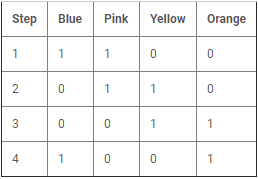
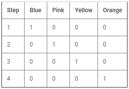

<!-- README.md file for proj010pic16f887 -->

## PROJECT: proj010pic16f887
---

## Aim:
---
To interface a stepper motor and rotate stepper motor in clockwise or anticlockwise with speed control.

### Apparatus/Software applications: 
---
- MPLAB X IDE v5.35
- SimulIDE_0.4.14-SR5

**Main Program**: [steppermotor.c](proj010pic16f887.X/steppermotor.c)

<object data="proj010pic16f887.X/steppermotor.c" type="text/c" width="600"></object>

|Components/Category|Components names in Circuit|
|---|---|
|Integrated Circuits (IC)|PIC16F887, <a href="#ULN2804" title="Brief description on ULN2804">ULN2804</a> (Motorla Octal high voltage, high current Darlington transistor array chip)|
|Power supply|DC supply1(5V), DC supply2(5V)|
|Switches|Switch, SwitchDip|
|Resistors|R(1 KOhm), ResistorDip(1 KOhm)|
|Load|<a href="#stepper" title="A breif description on 5-pin stepper motor">Stepper motor</a>|

 

### Circuit Diagram: 
---

**Note:** Lit LEDs turn yellow in color.

  
<i>**Figure:** proj010pic16f887.png: Producing variable PWM using timer0 and internal ADC.</i>

[A video clip of circuit simulation.](proj010pic16f887.mp4 "proj010pic16f887.mp4"
)

<video src="proj010pic16f887.mp4" type="video/mp4" controls muted width="500" height="400">Video tag not supported</video>  <!--atributes: autoplay loop -->

## Description: 
---
- Higher nibble of `PORTD` is made digital output using `TRISB` which is used to drive `ULN2804` which in-turn drives 5-pin stepper motor. 
- `RB3`, `RB4`, `RB5` and `RB6` of `PORTB` are made digital inputs using `ANSELH` and `TRISB`. `RB3` pin is used to change the direction of rotation of the motor. These four lines are controlled using switches and <a href="#PD" title="Brief on Pull up/Pull down resistors is blow">pull down resistor</a>s. When `RB3` is high the stepper motor rotates in clockwise direction, rotates in anti-clockwise direction otherwise. Speed control configuration is tabulated below.   

|Speed in `steps per second`|State of `RB6`, `RB5`, `RB4`|
|:---:|:---:|
|4|RB6=RB5=RB4=0|
|8|RB6=1; RB5=RB4=0;|
|2|RB5=1; RB6=0 or 1; RB4=0;|
|1|RB4=1; RB6=0 or 1; RB5=0 or 1;|

- While driving the motor, only one line out of the four control lines (`RD7`, `RD6`, `RD5`, `RD4` higher nibble of `PORTD`) is made high. Which is applied to ULN2804's input lines, where each of its input states is inverted (if high, it is made low, and vice-versa) at the output. Therefore, the other three lines which are high in voltage are controlling the position of the rotor of the motor. Sequentially, we change the line which is to be high among four to rotate the rotor. The order of the sequence of switching the high line is reversed to make the rotor rotate in opposite direction. 

- `__delay_ms(x)` is a macro to produce time delay in terms of milli-seconds. And it's definition is as follows:  
`#define __delay_ms(x) _delay((unsigned long)((x)*(_XTAL_FREQ/4000.0)))`  
    > where 
    > - `_delay((unsigned long)((x)*(_XTAL_FREQ/4000.0)))` is `_delay(x)`.  
    > - `x` in `_delay(x)` is the count of instruction cycles.  
    > - `_XTAL_FREQ` is the operating frequency of the system (PIC16F887 in our case).
* At 4MHz, `__delay_ms(100)` is equal to `_delay(100000)`. That is, 100000 instruction cycles. Which makes 1 milli-second equal to 1 instruction cycle. Which finally means that `NOP` _--assembly instruction for no operation (which is a single cycle instruction.)--_ is performed 100000 times to achieve the 100 milli-second delay.  
* At 8MHz, `__delay_ms(100)` is equal to `_delay(200000)`. That is, 200000 instruction cycles to execute `NOP` instruction. At this frequency of the system, 2 instruction cycles perform `NOP` to achieve 1ms delay.  
* Just notice, how many instruction cycles are need to be `NOP` filled to achieve desired real time delay.

---
   <!--br tag is just line-break tag in html-->

## ULN2804 (Octal High Voltage, High Current Darlington Transistor Array)
---
**Source:** <https://www.androiderode.com/uln2804-transistor-array/>  

The eight NPN Darlington connected transistors in this family of arrays are ideally suited for interfacing between low logic level digital circuitry (such as TTL, CMOS or PMOS/NMOS) and the higher current/voltage requirements of lamps, relays, printer hammers or other similar loads for a broad range of computer, industrial, and consumer applications. All devices feature open–collector outputs and free wheeling clamp diodes for transient suppression.  
  
<i>**Figure:** proj010pic16f887.png: Producing variable PWM using timer0 and internal ADC.</i>

The ULN2803 is designed to be compatible with standard TTL families while the ULN2804 is optimized for 6 to 15 volt high level CMOS or PMOS.  
*Rating:*
1. Output Voltage VO=50 V
2. Input Voltage (Except ULN2801) VI = 30 V
3. Collector Current – Continuous IC = 500 mA
4. Base Current – Continuous IB = 25 mA
5. Operating Ambient Temperature Range TA = 0 to +70°C
6. Storage Temperature Range Tstg: –55 to +150°C
7. Junction Temperature TJ: 125°C.

---

   <!--br tag is just line-break tag in html-->

## Pull up resistor / Pull down resistor
---
**Source:** <https://eepower.com/resistor-guide/resistor-applications/pull-up-resistor-pull-down-resistor/>  

**What are pull-up resistors?**  
Pull-up resistors are resistors used in logic circuits to ensure a well-defined logical level at a pin under all conditions. As a reminder, digital logic circuits have _`three logic states`_: `high`, `low` and `floating` (or `high impedance`). The high-impedance state occurs when the pin is not pulled to a high or low logic level, but is left “floating instead. A good illustration of this is an unconnected input pin of a microcontroller. It is neither in a high or low logic state, and a microcontroller might unpredictably interpret the input value as either a logical high or logical low. Pull-up resistors are used to solve the dilemma for the microcontroller by pulling the value to a logical high state, as seen in the figure. If there weren’t for the pull-up resistor, the MCU’s input would be floating when the switch is open and brought down only when the switch is closed.  

  
<i>**Figure:** pull_up_resistor.jpg: Pull Up Resistor</i>

Pull-up resistors are not a special kind of resistors; they are simple fixed-value resistors connected between the voltage supply (usually +5V) and the appropriate pin, which results in defining the input or output voltage in the absence of a driving signal. A typical pull-up resistor value is 4.7kΩ, but can vary depending on the application.

**Pull-up resistor definition**
>Pull-up resistors are resistors which are used to ensure that a wire is pulled to a high logical level in the absence of an input signal.

**What are pull-down resistors?**  
Pull-down resistors work in the same manner as pull-up resistors, except that they pull the pin to a logical low value. They are connected between ground and the appropriate pin on a device. An example of a pull-down resistor in a digital circuit can be seen in the figure. A pushbutton switch is connected between the supply voltage and a microcontroller pin. In such a circuit, when the switch is closed, the micro-controller input is at a logical high value, but when the switch is open, the pull-down resistor pulls the input voltage down to ground (logical zero value), preventing an undefined state at the input. The pull-down resistor must have a larger resistance than the impedance of the logic circuit, or else it might be able to pull the voltage down by too much and the input voltage at the pin would remain at a constant logical low value – regardless of the switch position.

  
<i>**Figure:** pull_down_resistor.jpg: Pull Down Resistor</i>

**Pull-up resistor value**  
The appropriate value for the pull-up resistor is limited by two factors. The first factor is power dissipation. If the resistance value is too low, a high current will flow through the pull-up resistor, heating the device and using up an unnecessary amount of power when the switch is closed. This condition is called a strong pull-up and is avoided when low power consumption is a requirement. The second factor is the pin voltage when the switch is open. If the pull-up resistance value is too high, combined with a large leakage current of the input pin, the input voltage can become insufficient when the switch is open. This condition is called having a weak pull-up. The actual value of the pull-up’s resistance depends on the impedance of the input pin, which is closely related to the pin’s leakage current.

A rule of thumb is to use a resistor that is at least 10 times smaller than the value of the input pin impedance. In bipolar logic families which operate at 5V, the typical pull-up resistor value is 1-5 kΩ. For switch and resistive sensor applications, the typical pull-up resistor value is 1-10 kΩ. If in doubt, a good starting point when using a switch is 4.7 kΩ. Some digital circuits, such as CMOS families, have a small input leakage current, allowing much higher resistance values, from around 10kΩ up to 1MΩ. The disadvantage when using a larger resistance value is that the input pin responses to voltage changes slower. This is the result of the coupling between the pull-up resistor and the line capacitance of the wire which forms an RC circuit. The larger the product of R and C, the more time is needed for the capacitance to charge and discharge, and consequently the slower the circuit. In high-speed circuits, a large pull-up resistor can sometimes limit the speed at which the pin can reliably change state.

**Typical applications for pull-up and pull-down resistors**  
Pull-up and pull-down resistors are often used when interfacing a switch or some other input with a microcontroller or other digital gates. Most microcontrollers have in-built programmable pull up/down resistors so fewer external components are needed. It is possible to interface a switch with such microcontrollers directly. Pull-up resistors are in general used more often than pull-down resistors, although some microcontroller families have both pull-up and pull-downs available.

They are often used in analog to digital converters to provide a controlled current flow into a resistive sensor.

Another application is the I2C protocol bus, where pull-up resistors are used to enable a single pin to act as an input or an output. When not connected to a bus, the pin floats in a high-impedance state.

Pull-down resistors are also used on outputs to provide a known output impedance.

---
   <!--br tag is just line-break tag in html-->

## 5-pin Stepper Motor
---
**Source:** <https://circuitdigest.com/microcontroller-projects/interfacing-stepper-motor-with-pic16f877a>

Stepper Motor is a specially designed motor which rotates in steps. Speed of stepper motor depends on the rate of electrical signal applied to it. Different patterns can control stepper motor’s direction and rotation type. Mainly two types of stepper motors are available, Unipolar and Bipolar. Unipolar is easier to operate, control and also easier to get.  

Consider `28BYJ-48` stepper motor which is cheap and easily available. It is 5V DC unipolar stepper motor. We will need a Module with this motor, ULN2003 a Stepper Motor Driver IC. We used ULN2804 in our simulation. ULN2003 is a Darlington pair array, which is useful to drive this motor, since PIC microcontroller couldn’t provide enough current to drive. ULN2003A is capable to drive 500mA of load with 600mA of peak current.  
  
<i>**Figure:** spec28BYJ-48.jpg: The specification of the 28BYJ-48 Stepper Motor from the datasheet.</i>  

**Stepper motor pin out**  
  
<i>**Figure:** Stepper-motor-pinout.png</i>  
Inside the motor there are two center tapped coils available. Red wire is the common for both which will be connected at VCC or 5V. Other 4 wires pink, red, yellow and blue will control the rotation depending on the electrical signal. Also, depending on the movement, this motor can be operated in 3 modes. `Full drive mode`, `Half Drive mode` and `Wave drive mode`.  

**Three Driving Modes of Stepper Motor:**
---
**Full Drive:** If two stator electromagnets are energized at a time, the motor will run at full torque referred as full-drive sequence mode.  
  
<i>**Figure:** stepresolution.png</i>  
**Half-Drive:** When alternatively one and two phases are energized, the motor will run in half drive mode. It’s used to increase the angular resolution. Drawback is less torque produced in this movement.  
  
<i>**Figure:** stepresolution.png</i>  
**Wave Drive:** In this mode, one stator electromagnet is turned on. It follows 4 steps same as Full-drive mode. It consumes low power with low torque.  
  
<i>**Figure:** stepresolution.png</i>  

We, in our simulation are running our motor in wave-drive mode.  

In cases where step resolution matters, we can use the following relation.  
  
<i>**Figure:** stepresolution.png</i>  
*For example:* 
> - No. of steps, N = 20
> - No. of sequence (fixed for a motor) = 4 (Like in 2 co-ordinate 4-quadrant graph)
> - Steps in each sequence (quadrant) = N/No. of sequence =20/4 =5 steps.
> - Step resolution =Total angle/total no. of steps =360/20 = 18 degrees.

We usually get step resolution to determine the remaining.

---
