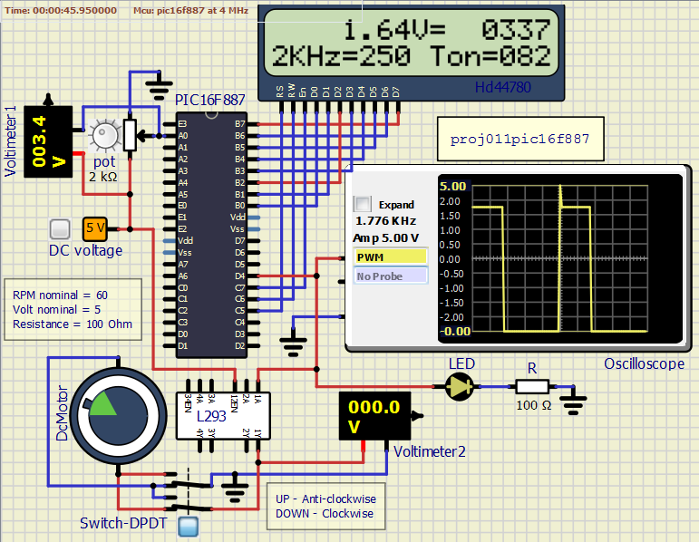

<!-- README.md file for proj011pic16f887 -->

## PROJECT: proj011pic16f887
---

## Aim:
---
To demonstrate Pulse Width Modulation. Duty cycle of the output signal is controlled using ADC and TIMER0 of the controller.  
To produce PWM signal of a certain frequency. The duty cycle of the signal is varied with respect to an analog input voltage. We use ADC module of the controller to convert analog input voltage to equivalent digital value. We use Timer0 to get the desired output frequency. Atleast close to desired. We then feed that PWM signal to dc motor as well to control its speed.

### Apparatus/Software applications: 
---
- MPLAB X IDE v5.35
- SimulIDE_0.4.14-SR5

**Main Program**: [dcmotorpwmtmr0adc.c](proj011pic16f887.X/dcmotorpwmtmr0adc.c)

<object data="proj011pic16f887.X/dcmotorpwmtmr0adc.c" type="text/c" width="600"></object>

|Components/Category|Components names in Circuit|
|---|---|
|Integrated Circuits (IC)|PIC16F887, <a href="#L293D" title="Brief description on L293D">L293 or L293D</a> (Quadruple Half H DC motor driver)|
|Power supply|DC voltage(5V)|
|LCD|<a href="#HD44780" title="Brief description on HD44780">HD44780</a>|
|Resistors|R(100 Ohm), pot(2 KOhm)|
|Voltmeters|Voltmeter1, Voltmeter2|
|LEDs|LED|
|Scopes|Oscilloscope|
|Switches|Switch-DPDT(Double Pole Double Throw)|
|Loads|DC motor|

 

### Circuit Diagram: 
---

**Note:** Lit LEDs turn yellow in color.

  
<i>**Figure:** proj011pic16f887.png: Producing variable PWM using timer0 and internal ADC.</i>

[A video clip of circuit simulation.](proj011pic16f887.mp4
)

<video src="proj011pic16f887.mp4" type="video/mp4" controls muted width="500" height="400">Video tag not supported</video>  <!--atributes: autoplay loop -->

## Tabular Column:
Potentiometer range: 0 to 2 KOhm; ADC value range: 0 to 1023; Frequency: 2 KHz equivalent to 250 counts in TMR0 based on selected prescaler.

|Pot value in `Ohms`|Voltage across pot in `volts`|Voltage across `AN0` channel in `volts`|ADC count|Ton count of the signal|Toff count of the signal|Duty cycle (%)|
|:---:|:---:|:---:|:---:|:---:|:---:|:---:|
|0|0.0000025|5|1023|249|1|99.6|
|10|0.025|4.97|1018|248|2|99.2|
|50|0.125|4.87|997|243|7|97.2|
|100|0.25|4.75|972|237|13|94.8|
|200|0.5|4.5|921|225|25|90|
|400|1|3.99|818|199|51|79.6|
|600|1.5|3.49|716|174|76|69.6|
|800|2|3|614|150|100|60|
|1000|2.5|2.5|512|125|125|50|
|1200|3|1.99|409|99|151|39.6|
|1400|3.5|1.5|307|75|175|30|
|1600|4|1|205|50|200|20|
|1800|4.5|0.49|102|24|226|9.6|
|1900|4.7|0.24|51|12|238|4.8|
|1950|4.9|0.12|26|6|244|2.4|
|1990|5|0.02|5|1|249|0.4|
|2000|5|0|0|1|249|0.4|

**Observation:** Few amount of voltage (which is supplied from DC supply) is dropped in potentiometer based on its value and the remaining amount of voltage is supplied to the `AN0` channel, which results in displaying the DC value equivalent to the voltage at the `AN0` pin; along with the voltage at the `AN0` pin. As the analog input voltage varies, the duty cycle of the PWM signal is varied. In our case, as the analog voltage decreased the duty cycle of the signal is decreased, and the reverse is true.

## Description: 
---
- **A/D Conversion procedure**  
This is an example procedure for using the ADC to
perform an Analog-to-Digital conversion:
> 1 Configure Port:
>> - Disable pin output driver (See TRIS register)
>> - Configure pin as analog

> 2 Configure the ADC module:
>> - Select ADC conversion clock
>> - Configure voltage reference
>> - Select ADC input channel
>> - Select result format
>> - Turn on ADC module

> 3 Configure ADC interrupt (optional):
>> - Clear ADC interrupt flag
>> - Enable ADC interrupt
>> - Enable peripheral interrupt
>> - Enable global interrupt

> 4 Wait the required acquisition time.

> 5 Start conversion by setting the GO/DONE bit.

> 6 Wait for ADC conversion to complete by one of the following:
>> - Polling the GO/DONE bit
>> - Waiting for the ADC interrupt (interrupts enabled)

> 7 Read ADC Result

> 8 Clear the ADC interrupt flag (required if interrupt is enabled).

- `RA0` is made as analog input using `TRISA0` of `TRISA` and `ANS0` of `ANSEL` respectively; which will be chosen as `AN0`, an ADC input channel.
- `PORTB` is used to send 8-bit data to display characters on the LCD screen or 8-bit command value to control the possible aspects of the LCD (like cursor position, clearing screen, etc.). `PORTB` direction of operation is controlled using `TRISB`. Just to make sure the port to be a digital port, we can assign `ANSELH` register with value `0x00` manually in the program though it is set so on MCU power-up.
- `RC7`, `RC6` and `RC5` of `PORTC` are used as control lines of LCD (viz, `EN`, `RW` and `RS` respectively).
- `RD4`, which is actually the pin that outputs the PWM signal, is used to drive an LED, Oscilloscope and DC motor (through <a href="#L293D" title="Brief description on L293D">L293 or L293D</a> (Quadruple Half H DC motor driver)). `RD4` pis made an output pin using `TRISD4`.
- `OPTION_REG` is configured in such a way that PORTB pull-ups are disabled, clock source for timer0 is internal instruction cycle clock (FOSC/4) (i.e., timer0 is in timer mode), TMR0 increments on low-to-high transition, prescaler is assigned to the Timer0 module and prescaler rate is selected as needed using selectio bits. We chose the prescaler rate of 1:2 with intent to generate 2KHz PWM signal. `TMR0` is an 8-bit register that can count 256 counts in the range from 0 to 255.  Based on this limitation we choose the prescaler rate using the following figure.
  
<i>**Figure:** prescaler_forula.jpg: Prescaler rate selection formula.</i>
- *If we do not use prescaler:* We chose the frequency of our controller to be 4MHz. Therefore, the TMR0 runs(increments its value) at the frequency equal to fosc/4, i.e., 1 mega counts in a second. Which means, by the time the controller completes 4 mega counts, the TMR0 completes 1 mega counts. Thus the output frequency will be 1MHz. But still, this is not possible beacause TMR0 cannot count upto 1000000, since its value can range from 0 to 255.
- *When we choose a prescaler (say 1:2):* Lets say our output frequency to be 2KHz. On substituting in the formula, `count=fosc/(4*prescaler*fout)`, count=4000000/(4\*2\*2000), will produce the count value equal to 250, which can fit in TMR0 and thus the prescaler we selected is good to go.
- Let us consider another example where we want to generate the signal of frequency 50Hz. If we select the prescaler rate as 1:2, count=4000000/(4\*2\*50) will be count=10000. Which will fail to fit in TMR0. Therefore, we cannot choose 1:2 prescaler rate. Prescaler rate, 1:4 results 5000 counts, 1:8 results 2500 counts, 1:16 results 1250 counts, 1:32 results 625 counts, 1:64 results 312.5 counts, which will fail. But prescaler rate 1:128 will result in 156.25 counts (fits in TMR0) which should be round-figured to either 157 or 156 accordingly there will be slight variation in th output frequency.
- From that derived count value, we split it as needed to decide On-time and Off-time of the signal. Lets say we want 25% duty cycle. 25% On-time in counts is 156/4=39. So we assign `Ton=256-39` that is Ton=217, which will be fed to TMR0. Now TMR0 has the value 217 and TMR0 starts to increment and rolls-over after reaching 255, making the `T0IF=1`, which needs to be cleared everytime in the program. Similarly, `Toff=256-(157-39)=139` is calculated and assigned to TMR0. TMR0 starts to increment from 139 and rolls-over after reaching 255, making the `T0IF=1`.

 

- **HD44780**
> - **Pinout diagram**  
  
*NOTE:* In our circuit diagram created from simulIDE, the potentiometer connections and few other pins are hidden. But are necessary during practical circuit.

> - **Pin Description**  
> *Source:* <https://en.wikipedia.org/wiki/Hitachi_HD44780_LCD_controller>  
<table>
    <tr><th align="center">Pin No.</th><th align="center">Pin Description</th></tr>
    <tr><td>1</td><td>Ground</td></tr>
    <tr><td>2</td><td>VCC +3.3 to +5V (typical)</td></tr>
    <tr><td>3</td><td>Contrast adjustment (VO) This is an analog input, typically connected to a potentiometer. The user must be able to control this voltage independent of all other adjustments, in order to optimise visibility of the display that varies i.a. with temperature, and, in some cases height above the sea level. With a wrong adjustment the display will seem to malfunction.</td></tr>
    <tr><td>4</td><td>Register Select (RS). RS=0: Command, RS=1: Data</td></tr>
    <tr><td>5</td><td>Read/Write (R/W). R/W=0: Write, R/W=1: Read (In most applications reading from the HD44780 makes no sense. In that case this pin can be permanently connected to ground and no io pins need to be allocated to steer it.)</td></tr>
    <tr><td>6</td><td>Clock (Enable). Falling edge triggered</td></tr>
    <tr><td>7</td><td>Bit 0 (Not used in 4-bit operation)</td></tr>
    <tr><td>8</td><td>Bit 1 (Not used in 4-bit operation)</td></tr>
    <tr><td>9</td><td>Bit 2 (Not used in 4-bit operation)</td></tr>
    <tr><td>10</td><td>Bit 3 (Not used in 4-bit operation)</td></tr>
    <tr><td>11</td><td>Bit 4</td></tr>
    <tr><td>12</td><td>Bit 5</td></tr>
    <tr><td>13</td><td>Bit 6</td></tr>
    <tr><td>14</td><td>Bit 7</td></tr>
    <tr><td>15</td><td>Backlight Anode (+) (If applicable)</td></tr>
    <tr><td>16</td><td>Backlight Cathode (-) (If applicable)</td></tr>
</table>

> - **Instruction Set**  
> *Source:* <https://en.wikipedia.org/wiki/Hitachi_HD44780_LCD_controller>  

<table>
    <tr>
        <th rowspan="2" align="center">Instruction</th>
        <th colspan="10" align="center">Code</th>
        <th rowspan="2" align="center">Description</th>
        <th rowspan="2" align="center">Execution time (max)(when fcp = 270 kHz)</th>
    </tr>
    <tr>
        <td>RS</td><td>R/W</td>
        <td>B7</td><td>B6</td><td>B5</td><td>B4</td><td>B3</td><td>B2</td><td>B1</td><td>B0</td>
    </tr>
    <tr>
        <td>Clear Display</td><td>0</td><td>0</td>
        <td>0</td><td>0</td><td>0</td><td>0</td><td>0</td><td>0</td><td>0</td><td>1</td>
        <td>Clears display and returns cursor to the home position (address 0).</td>
        <td>1.52 ms</td>
    </tr>
	<tr>
        <td>Cursor home</td><td>0</td><td>0</td>
        <td>0</td><td>0</td><td>0</td><td>0</td><td>0</td><td>0</td><td>1</td><td>*</td>
        <td>Returns cursor to home position. Also returns display being shifted to the original position. DDRAM content remains unchanged.</td>
        <td>1.52 ms</td>
    </tr>
    <tr>
        <td>Entry mode set</td><td>0</td><td>0</td>
        <td>0</td><td>0</td><td>0</td><td>0</td><td>0</td><td>1</td><td>I/D</td><td>S</td>
        <td>Sets cursor move direction (I/D); specifies to shift the display (S). These operations are performed during data read/write.</td>
        <td>37 μs</td>
    </tr>
    <tr>
        <td>Display on/off control</td><td>0</td><td>0</td>
        <td>0</td><td>0</td><td>0</td><td>0</td><td>1</td><td>D</td><td>C</td><td>B</td>
        <td>Sets on/off of all display (D), cursor on/off (C), and blink of cursor position character (B).</td>
        <td>37 μs</td>
    </tr>
	<tr>
        <td>Cursor/display shift</td><td>0</td><td>0</td>
        <td>0</td><td>0</td><td>0</td><td>1</td><td>S/C</td><td>R/L</td><td>*</td><td>*</td>
        <td>Sets cursor-move or display-shift (S/C), shift direction (R/L). DDRAM content remains unchanged.</td>
        <td>37 μs</td>
    </tr>
	<tr>
        <td>Function set</td><td>0</td><td>0</td>
        <td>0</td><td>0</td><td>1</td><td>DL</td><td>N</td><td>F</td><td>*</td><td>*</td>
        <td>Sets interface data length (DL), number of display line (N), and character font (F).</td>
        <td>37 μs</td>
    </tr>
	<tr>
        <td>Set CGRAM address</td><td>0</td><td>0</td>
        <td>0</td><td>1</td>
        <td colspan="6" align="center">CGRAM address</td>
        <td>Sets the CGRAM address. CGRAM data are sent and received after this setting.</td>
        <td>37 μs</td>
    </tr>
	<tr>
        <td>Set DDRAM address</td><td>0</td>
        <td>0</td><td>1</td><td colspan="7" align="center">DDRAM address</td>
        <td>Sets the DDRAM address. DDRAM data are sent and received after this setting.</td>
        <td>37 μs</td>
    </tr>
	<tr>
        <td>Read busy flag & address counter</td><td>0</td><td>1</td>
        <td>BF</td><td align="center" colspan="7">CGRAM/DDRAM address</td>
        <td>Reads busy flag (BF) indicating internal operation being performed and reads CGRAM or DDRAM address counter contents (depending on previous instruction).</td>
        <td>0 μs</td>
    </tr>
	<tr>
        <td>Write CGRAM or DDRAM</td><td>1</td><td>0</td>
        <td align="center" colspan="8">Write Data</td>
        <td>Write data to CGRAM or DDRAM.</td>
        <td>37 μs</td>
    </tr>
    <tr>
        <td>Read from CG/DDRAM</td><td>1</td><td>1</td>
        <td align="center" colspan="8">Read Data</td>
        <td>Read data from CGRAM or DDRAM.</td>
        <td>37 μs</td>
    </tr>
    <tr>
        <td colspan="13" align="justify">
        Instruction bit names —

I/D - 0 = decrement cursor position, 1 = increment cursor position; S - 0 = no display shift, 1 = display shift; D - 0 = display off, 1 = display on; C - 0 = cursor off, 1 = cursor on; B - 0 = cursor blink off, 1 = cursor blink on ; S/C - 0 = move cursor, 1 = shift display; R/L - 0 = shift left, 1 = shift right; DL - 0 = 4-bit interface, 1 = 8-bit interface; N - 0 = 1/8 or 1/11 duty (1 line), 1 = 1/16 duty (2 lines); F - 0 = 5×8 dots, 1 = 5×10 dots; BF - 0 = can accept instruction, 1 = internal operation in progress.
        </td>
    </tr>
</table>

> - Few specific byte-codes to highlight:
>> - `0x04` - move cursor right, don’t shift display.
>> - `0x05` - move cursor right, do shift display (left).
>> - `0x06` - move cursor right, don’t shift display (this is the most common).
>> - `0x07` - move cursor right, do shift display (left).
>> - `0x08 ... 0x0B` - turn display off.
>> - `0x0c` - display on, cursor off.
>> - `0x0e` - display on, cursor on, steady cursor.
>> - `0x0f` - display on, cursor on, blinking cursor.
>> - `0x10` - Shift cursor left.
>> - `0x14` - Shift cursor right.
>> - `0x18` - Shift display left.
>> - `0x1c` - Shift display right.
>> - `0x80 + position` - Cursor position
> - HD44780 is designed to control a 40 character 4-line display. If you have a 16×2 then you will only see the first 16 characters of the top two lines. In a 16x2 display, the first line is position 0-15. Therefore, 0x80 is the first position, 0x80 + 12 = 0x8C is the 13th (remember, they are zero indexed). 0xc0 is the first position in the second line in the LCD screen.

- 5V DC is applied to the analog channel `AN0` through a 5 KOhm potentiometer. Whenever the ADC conversion function is called, the analog DC voltage at the analog input channel is converted to digital equivalent using internal ADC and the result is stored in specific registers (`ADRESH`+`ADRESL`).
- The internal ADC stores the result in 10-bit size. Therefore the range is `0000000000` to `1111111111` in binary which is `0` to `1023` in integer(base 10). Therefore our maximum input voltage is sampled to `1024` values. In our case where max. voltage is `5V is equal to ADC value of 1023`. Which means, `ADC value of 564 is equal to 2.57V approximately`.
- Then ADC result which is in binary is converted to decimal and and each digit is passed per instance to the LCD with the necessary adjustments. Each adjusted digit is placed in PORTB which is then passed to LCD.
- While displaying equivalent voltage of an ADC value, few calculations are made in the program. Suitable sized variables are used in the program. What actually hapens here is that the ADC value (0 - 1023) is sampled back to voltage value (0V - 5.0V). Consider an example, ADC value about 490 as shown in circuit diagram above and notice its equivalent voltage value which is about 2.39V.
> - `5*490/1023` will be stored as `2` in an integer variable, even though the actual value is `2.3949...`.
> - Therefore, `5*490/1023` is changed to `(500*490)/1023`. Here the order of the operands and size of the variables are important.
> - `500*490` will produce the value `245000`. Therefore the variable's size matter. Now the variable has the value `245000`.
> - `245000/1023` will produce the value `239.4916`. But the integer valiable stores only `239`.
> - Now we display the first digit and then a period and then the next two digits.
> - Just consider if we write the equation in this way in program: `490/1023*500`.
> - `490/1023` will produce `0.4789`, but `0` is stored in the memory location.
> - `0*500` will produce `0` and the value stored inside the memory location will be `0`.
> - Please note that the RHS of an equation in a program is evaluated left to right and each operation's (addition, subtraction, ...) value is stored in temporary memory locations and used for the following operations until there is the final single value left. Then that value is loaded to the variable on LHS. On performing each operation in equation, it appeared as if the temporary memory location's size (thus created) is determined based on the size of the biggest variable among the operands of the operation, which didn't seem right though.
- The ADC maximum possible count and the maximum count value which is derived for a particular frequency are sampled with respect to each other in such a way that by varying the analog input voltage we vary the duty cycle of the signal.
- We run the controller at a particular frequency. We use `TMR0` to produce the PWM signal of desired frequency within the limited range at pin `RD4`. And acordingly `OPTION_REG` is configured. The output at the `RD4` is fed to Oscilloscope to observe the PWM signal. Corresponding Ton counts are displayed on the LCD screen.
- Once the Ton and Toff are calculated, they are assigned to TMR0 individually. We vary the duty cycle of the signal after every 3 seconds by changing the values on Ton and Toff.
> - 8-bit HEX code is put on `PORTB`; `EN` is made high; `RW` is made low to ensure that the controller is writing to the LCD; `RS`, called as Register Select pin based on which the HEX code on PORTB is considered as either *command* or *data*. `RS=0` for the HEX code to be a command and `RS=1` for the HEX code to be data which gets displayed on the screen.
> - In our program we wrote two functions named as command and data to choose between the operation type. We use command function to set cursor position (if needed), to clear display, whether the cursor gets automatically incremented and etc. Then we use data function to display the HEX code with corresponding ASCII code on the LCD screen.
- `__delay_ms(x)` is a macro to produce time delay in terms of milli-seconds. And it's definition is as follows:  
`#define __delay_ms(x) _delay((unsigned long)((x)*(_XTAL_FREQ/4000.0)))`  
    > where 
    > - `_delay((unsigned long)((x)*(_XTAL_FREQ/4000.0)))` is `_delay(x)`.  
    > - `x` in `_delay(x)` is the count of instruction cycles.  
    > - `_XTAL_FREQ` is the operating frequency of the system (PIC16F887 in our case).
* At 4MHz, `__delay_ms(100)` is equal to `_delay(100000)`. That is, 100000 instruction cycles. Which makes 1 milli-second equal to 1 instruction cycle. Which finally means that `NOP` _--assembly instruction for no operation (which is a single cycle instruction.)--_ is performed 100000 times to achieve the 100 milli-second delay.  
* At 8MHz, `__delay_ms(100)` is equal to `_delay(200000)`. That is, 200000 instruction cycles to execute `NOP` instruction. At this frequency of the system, 2 instruction cycles perform `NOP` to achieve 1ms delay.  
* Just notice, how many instruction cycles are need to be `NOP` filled to achieve desired real time delay.

---
 

## L293D – Quadruple Half H DC Motor Driver
---

**Source:** <https://electrosome.com/l293d-quadruple-half-h-dc-motor-driver/>

L293 and L293D are quadruple half H Bridge driver having high current capability. It can also be seen as a dual H Bridge driver for driving Motors. L293D can provide currents up to 600mA and L293 can provide currents up to 1A at voltages ranging from 4.5V to 36V. Both L293 and L293D are designed to drive inductive loads such as solenoids, relays, dc motors, bipolar stepper motors and other high current or voltage applications.  

**Features:**  
- Wide range of supply voltage from 4.5V to 36V.
- Separate Input Logic Supply can be provided.
- Output Current per channel 1A for L293 and 600mA for L293D.
- Peak Current per channel 2A for L293 and 1.2A for L293D.
- Output Clamp diodes are provided to drive inductive loads in L293D.
- Automatic Thermal Shutdown.

**Pin Diagram:**  
  
<i>**Figure:** L293Dpin.jpg: Pin diagram of L293D</i>  
- Vcc1 : Logic Input Voltage
- Vcc2: Driver/Motor Supply
- A : Input
- Y : Output
- 1, 2 EN : Enable Of First Pair  1, 2
- 3, 4 EN : Enable of Second Pair 3, 4

Drivers are enabled in pairs. Logic HIGH at EN1,2 pin enables the drivers 1 and 2. Logic HIGH at EN 3,4 enables the drivers 3 and 4. Logic Voltage should be provided to the Vcc1 pin and motor supply is given to Vcc2 pin. For example, if your motor works at 12v and you are going to control it with control signals from a PIC Microcontroller. Then you have to connect 12V to Vcc2 and 5V to Vcc1 pin and the ground of both supplies should be common.  
  
<i>**Figure:** block-diagram-of-L293-or-L293D.jpg: Block diagram of L293 or L293D</i>  

---