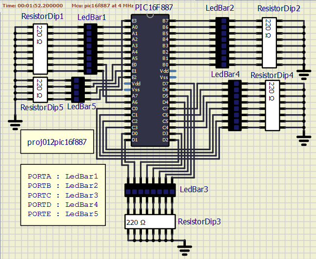

<!-- README.md file for proj012pic16f887 -->

## PROJECT: proj012pic16f887
---

## Aim:
---
Drive LEDs from all the available I/O lines of PIC16F887.

### Apparatus/Software applications: 
---
- MPLAB X IDE v5.35
- SimulIDE_0.4.13-SR5

**Main Program**: [allportsout.c](proj012pic16f887.X/allportsout.c)

<object data="proj012pic16f887.X/allportsout.c" type="text/c" width="600"></object>

|Components/Category|Components names in Circuit|
|---|---|
|Integrated Circuits (IC)|PIC16F887|
|Resistors|ResistorDip1(220 Ohm, size: 8), ResistorDip2(220 Ohm, size: 8), ResistorDip3(220 Ohm, size: 8), ResistorDip4(220 Ohm, size: 8), ResistorDip5(220 Ohm, size: 4)|
|LEDs|LEDBar1(size: 8), LEDBar2(size: 8), LEDBar3(size: 8), LEDBar4(size: 8), LEDBar5(size: 4)|

 

### Circuit Diagram: 
---

  
<i>**Figure:** proj012pic16f887.png</i>

[A video clip of circuit simulation.](proj012pic16f887.mp4
)

<video src="proj012pic16f887.mp4" type="video/mp4" controls muted width="500" height="400">Video tag not supported</video>  <!--atributes: autoplay loop -->

## Description: 
---
- All the I/O lines are made digital output lines using corresponding registers.
- Each port is made high individually with time gap of 150 milli-seconds.

---
## Inference:
---
- `RA3` and `RE3` can only function as general purpose input lines but not as general purpose output lines according to the datasheet of the controller.
- But in our simulation, `RA3` is still acting as general purpose output. `RA4` to `RA7` are not driving the LEDs as expected.

---

